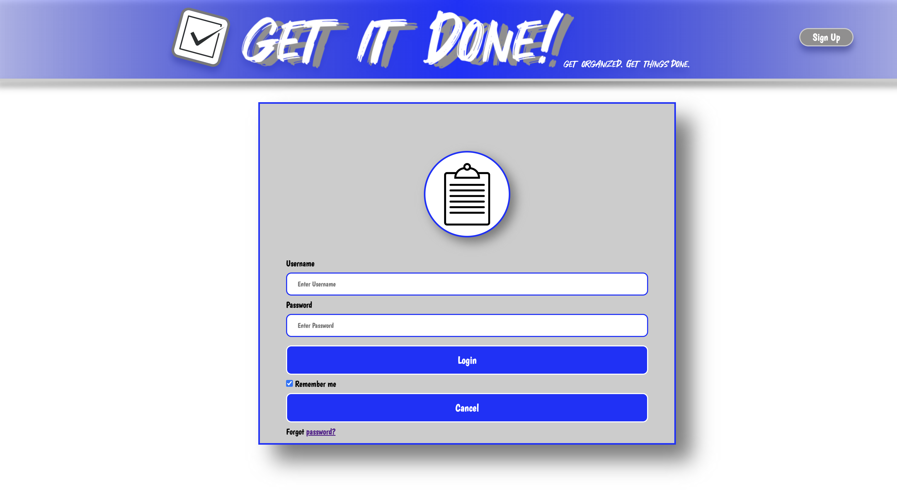

# To-do App

## 

Get it Done! is a web application designed to help users efficiently manage their tasks and subtasks. Whether you're a busy professional, a student with multiple assignments, or simply someone who wants to stay organized, this app provides a comprehensive and simplified solution to streamline your task management process.

## Screenshot(s)

## Technologies Used
- HTML
- CSS
- JavaScript
- Node.js
- Express.js
- MongoDB
- Mongoose
- Axios

## Getting Started
- Deployed App: [Link to Deployed App](https://your-deployed-app-url.com)
- Trello Board: [Link to Trello Board](https://https://trello.com/b/CFpgX3uL/to-do-list-app-development-trello-board-url.com)
- Figma Wireframe: [Link to Figma](https://www.figma.com/file/hRbu6KQc2KmbJLiAquOdli/Untitled?type=design&node-id=0%3A1&t=4UD2uIKQMyYzSOHr-1)

## Next Steps
- Allow users to create accounts and manage their own personalized to-do lists and implement user authentication for secure task management.
- Add due dates and reminders for tasks.
- Add a section to display tasks based on due dates and eventually a calendar.
- Introduce the ability to categorize tasks using tags or labels for better organization and filtering.
- Incorporate notifications and reminders for upcoming tasks.
- Mobile App: Develop a mobile application for users to access and manage tasks on the go.
- Enhance the UI/UX for a more intuitive user experience.
- Implement drag-and-drop functionality for task reordering.

## Resources
- W3 Schools: https://www.w3schools.com/
- MDN Web Docs: https://developer.mozilla.org/en-US/
- Fontspace: https://www.fontspace.com/
- PNGtree: https://pngtree.com/
- ChatGPT: https://chat.openai.com/
- SEIR-0508 Github Repos
- General Assembly TA's - Thank You to all of you that took the time to help!

